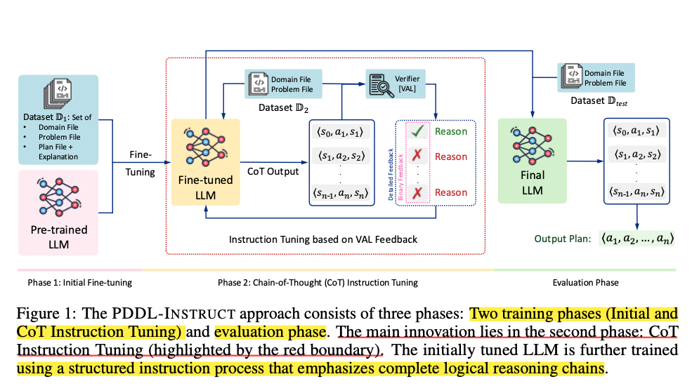
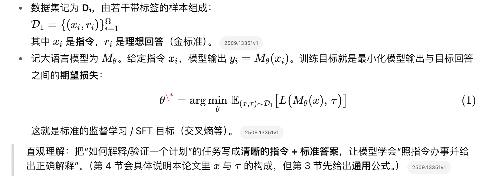

# Teaching LLMs to Plan: Logical Chain-of-Thought Instruction Tuning for Symbolic Planning

## Abstrcut

### 基本思想：

```
Chain-of-Thought + a novel Instruction tuning framework————PDDL-Instruct
```

### 方法概述：
```
Focus on teaching models to rigorously reason about action applicability, state transitions, and plan validity using explicit logical inference steps.
By developing instruction prompts that guide models through the precise logical reasoning required to determine when actions can be applied in a given state, we enable LLMs to self-correct their planning processes through structured reflection.
```

### 如图：

#### 包含两个训练阶段（初始微调和CoT指令微调）以及评估阶段。主要创新在于第二阶段：CoT 指令微调（红色边界突出显示）。初始调整后的 LLM 将使用强调完整逻辑推理链的结构化指令流程进行进一步训练。

## 精读 :book:

### 3 Preliminaries

#### Automated Planning 

##### 一个规划问题可以形式化为一个四元组 ⟨P, A, s₀, G⟩

· P：一组 fluents（命题/谓词原子）。可以把 fluent 理解成“此刻世界里某个事实是否为真”的布尔变量，比如 on(table, cup)、door_open。

· S（状态空间）= “对 P 里所有 fluent 真/假的所有可能赋值” 的集合。

· s ∈ S（一个具体状态）= 当前时刻哪些 fluent 为真（通常用集合表示“为真的那些 fluent”）。

· A：动作集合。每个动作 aᵢ ∈ A 都有三元组定义：⟨ pre(aᵢ), add(aᵢ), del(aᵢ) ⟩

· pre(aᵢ)：前置条件（这堆 fluent 必须在当前状态里为真，此动作才可执行）。

· add(aᵢ)：动作执行后会变真的一组 fluent。

· del(aᵢ)：动作执行后会变假的一组 fluent。

· s₀：初始状态（哪一些 fluent 一开始为真）。

· G：目标条件（我们希望在终态里为真的一组 fluent，或逻辑公式；经典情形常写成一个目标集合）。

##### 状态转移方程
sᵢ₊₁ = aᵢ ( sᵢ ) = ( sᵢ \ del ( aᵢ ) ) ∪ add ( aᵢ )

只有在 pre( aᵢ ) ⊆ sᵢ（前置条件都满足）时，动作 aᵢ 才“可执行”。

执行后：


  先把 del(aᵢ) 里的事实从当前真集 sᵢ 里删掉（这些变为假）；

  再把 add(aᵢ) 里的事实加入进去（这些变为真）；

  其余 fluent 保持不变（经典 STRIPS 假设：frame axiom 由 del/add 之外的都保持）。

##### 计划（plan） π

π = ⟨a₀, a₁, …, aₙ₋₁⟩

执行后得到状态序列 s₀ → s₁ → … → sₙ，若 sₙ ⊨ G（满足目标），则 π 是一个有效计划。

最优（optimal）：在动作代价相同的前提下，n 最小（步数最短）。

可行/满意（satisficing）：能到达 G 就行，不追求最短。

##### PDDL 表述

Domain D = ⟨P, A⟩：给出在这个“世界”里的 fluent 集与动作集（每个动作自带 pre/add/del）。

Problem Π = ⟨s₀, G⟩：某次具体求解要用的起点与目标。

合起来就是“在哪个世界（D）里，从 s₀ 出发，找满足 G 的计划”。

```example

任务：把杯子放到桌子上。

P（fluents）：holding(cup), on(cup, table), clear(hand) …

s₀：{ holding(cup), clear(table) }

G：{ on(cup, table) }

动作 a = put_on_table(cup, table)

pre(a) = { holding(cup), clear(table) }

add(a) = { on(cup, table), clear(hand) }

del(a) = { holding(cup) }

检查可执行性：pre(a) ⊆ s₀ ✅

执行：

s₁ = ( s₀ \ del(a) ) ∪ add(a)= { holding(cup), clear(table) } \ { holding(cup) } ∪ { on(cup, table), clear(hand) } = { on(cup, table), clear(hand), clear(table) }

这时 s₁ ⊨ G，所以 π = ⟨a⟩ 是有效计划。
```

#### Instruct Tuning



#### Chain-of-thought reasoning

给定输入 𝑥 和目标输出 𝑦 ，一条 CoT 过程 𝑅 是 K 个中间推理状态的序列：

Z ( x ) = ( z 1 , z 2 , … , z K)。

每个步骤 𝑧 𝑖 进一步拆成三元组：

𝑧 𝑖 ​= ( 𝑠 𝑖 ​, 𝑗 𝑖 ​, 𝑢 𝑖 ​)

其中：
𝑠 𝑖 ：符号化状态（这一步得到的事实/断言集合）；

𝑗 𝑖 ：正当性（用了哪条规则/推理把上一步变到这一步）；

𝑢 𝑖 ：不确定度（模型对该步的置信）。

本论文的化简：后续直接用 𝑠 𝑖 代表 𝑧 𝑖（一一对应），且不使用 𝑢 𝑖 ；也就是说，让模型直接给出每一步的符号状态即可。

CoT 的两个“好推理”性质：

1. 逻辑一致性（logical coherence）：每一步 𝑧 𝑖 都能由某个可辩护的规则 𝑗 𝑖−1 从上一步 𝑠 𝑖−1 合理地推出 𝑠 𝑖 。

2. 逐步精化（progressive refinement）：越到后面的推理状态，对最终答案 𝑦 的信息量（互信息）越大：𝐼 ( 𝑧 𝑖 ; 𝑦 ) > 𝐼 ( 𝑧 𝑖−1 ; 𝑦 )。

### 4 Problem Formulation

本章介绍了该论文的 Input 、Data Splitting 、Output 、Assumptions

#### 📘 Input

1. 预训练大模型 M：如 LLaMA 或 Qwen；

2. 数据集 D：含 PDDL 格式的规划领域与问题；

3. 验证器 V（如 VAL）：判断模型生成计划的正确性。
   
##### DataSet Details

1️⃣ 一组 planning domains ： {D₁, D₂, …, Dₙ}。

2️⃣ 每个 domain Dᵢ 下包含 mᵢ 个 planning problems Pᵢ = {Pᵢ,₁, Pᵢ,₂, …, Pᵢ,ₘᵢ}。

3️⃣ 每个 problem Pᵢ,ⱼ 对应多条 plan (Πᵢ,ⱼ) = {πᵢ,ⱼ,₁, πᵢ,ⱼ,₂, …, πᵢ,ⱼ,ₖᵢ,ⱼ}，其中既有 valid plan 也有 invalid plan。每条 plan πᵢ,ⱼ,ₗ 都是 grounded action 序列，并附有正确性或错误解释。

##### Explaination

1. 每条计划不只是动作序列，还包括解释信息（正确或错误原因），这为模型提供了监督信号。
   
2. “satisficing plans” 指满足目标即可，不要求最优路径。

#### ⚙️ Data Splitting

数据被分为：

D₁ → Phase 1：用于初始 Instruction Tuning；

D₂ → Phase 2：用于 CoT Instruction Tuning；

D_test → 测试集。

##### 为 D₁ 额外加入错误计划样本，让模型学会识别错误类型（如 Natural Instructions 那样）。

#### 🧠 Output

最终目标是得到一个指令微调后的模型 M_{θ*}，它在以下方面表现更好：

1. Domain representation – 理解 PDDL 领域结构；

2. Problem representation – 提取问题目标与初始状态；

3. Plan generation – 生成动作序列；

4. Action verification – 检查每个动作前置条件；

5. Plan verification – 整体逻辑有效性；

6. Reasoning transparency – 推理过程可解释。

#### ⚖️ Assumptions

论文假设 PDDL 域是简化版：

不包含 条件效应 (conditional effects)；

不包含 持续动作 (durative actions)。

仅保留 STRIPS-style 离散动作，这样 CoT 推理链更可控、更易验证。

### 5 PDDL-INSTRUCT: Methodology

#### Training the Model

##### Phase 1 Initial Instruction Tuning Phase

目标：让预训练 LLM 学会解释计划中动作的有效性。

输入：来自 D₁ 的数据，包括 PDDL 领域定义与规划问题。

方法：使用精心设计的 prompt，将「领域 + 问题」与「详细解答说明」配对，指导模型学习每个动作的前提条件（precondition）与效果（effect）验证。

该阶段同时包含正确和错误计划。

错误计划涵盖四类典型问题：

1. 动作前提不满足；

2. 效果错误；

3. 违反框架公理（frame axiom）；

4. 未达成目标状态。

通过正反样例+解释，模型不仅学习「计划语义」，也学到「错误识别」。

结果：模型具备了「规划逻辑语义」和「可解释验证」的能力；为下一阶段的推理式训练（Phase 2 CoT）奠定基础。

##### Phase 2 CoT Instruction Tuning Phase

